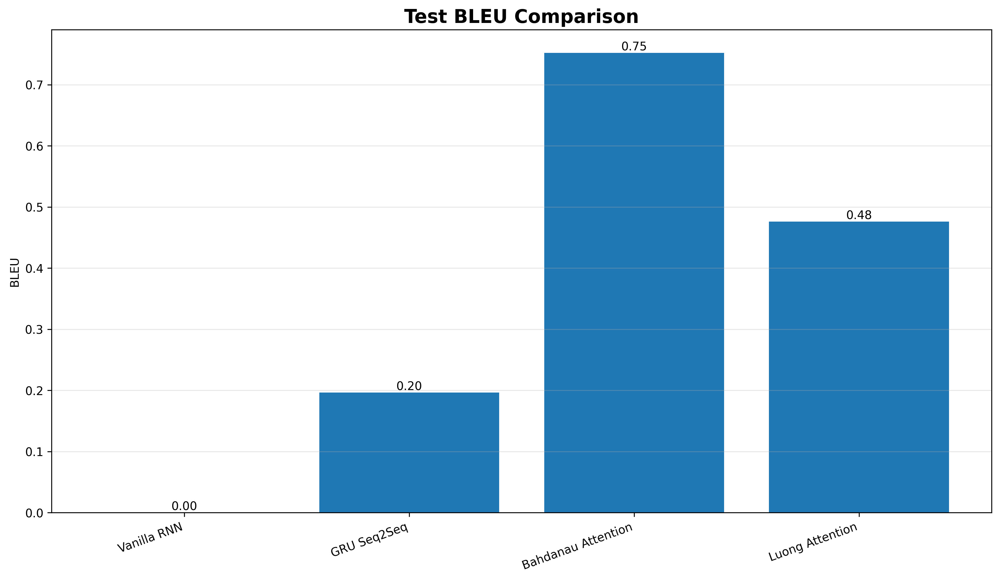
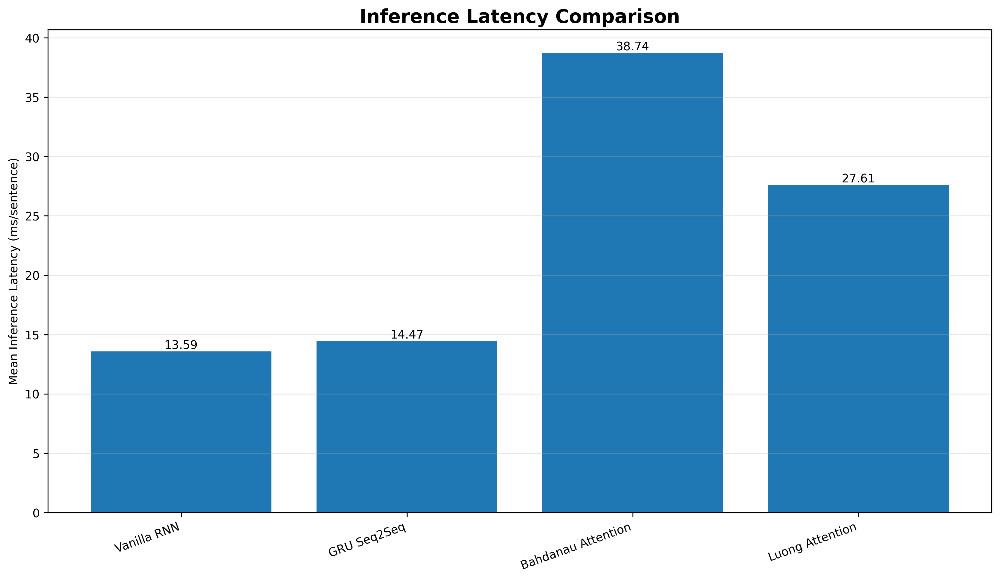
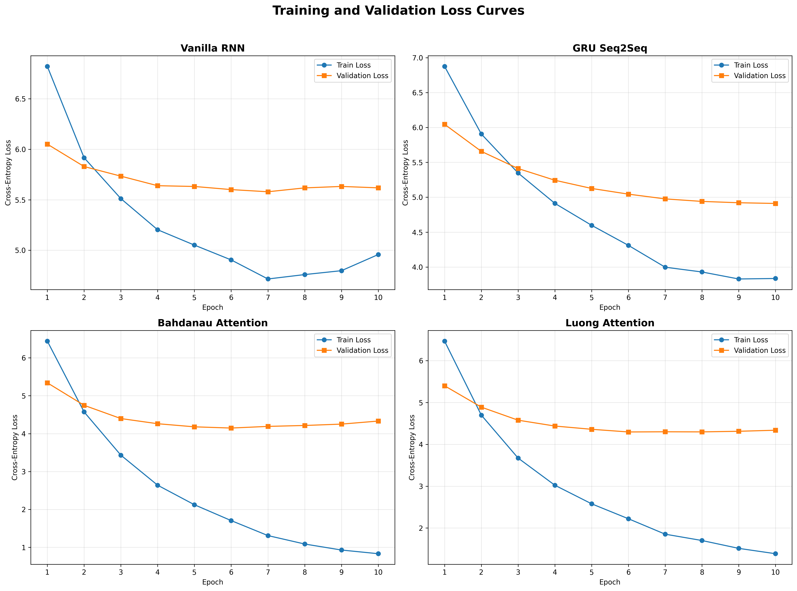
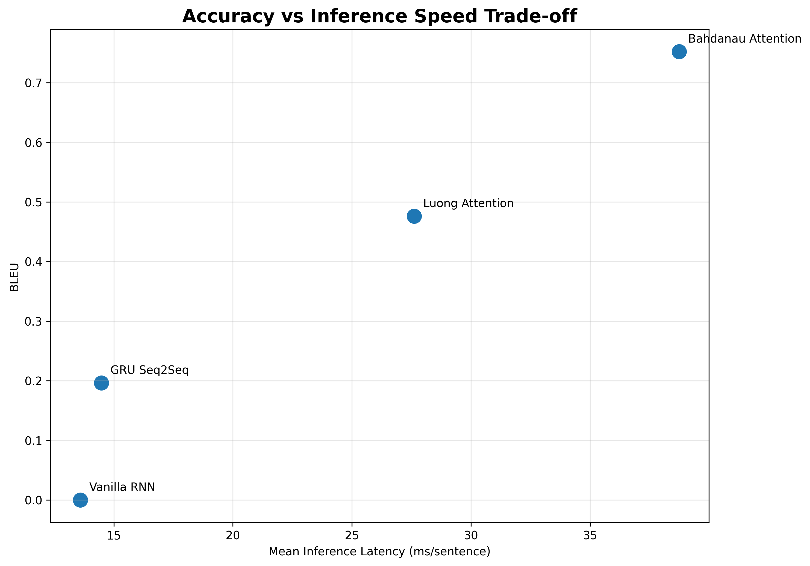

# Comparative Analysis of Neural Machine Translation Architectures

## 📌 Project Overview

This project presents a comparative experimental study of four Neural Machine Translation (NMT) architectures for English → Korean translation: Vanilla RNN, GRU Encoder–Decoder (Seq2Seq), Encoder–Decoder with Bahdanau Additive Attention, and Encoder–Decoder with Luong Multiplicative Attention. The project follows the experimental requirements of the assignment by using a bilingual dataset from the ManyThings.org Anki Language Datasets repository and evaluating all four models under comparable training and testing conditions. The main objective is to investigate how different sequence-modeling approaches and attention mechanisms affect translation quality, language-modeling performance, computational cost, and inference latency.

The project implements all four NMT architectures from scratch using PyTorch and uses a bilingual dataset for training and evaluation. The models are evaluated using both quantitative and qualitative criteria. BLEU is used to compare translation quality, while test cross-entropy loss and perplexity are used to assess language-modeling performance. In addition, inference latency, the number of trainable parameters, and training time are measured to compare computational efficiency. The project also analyzes the strengths and limitations of attention-based and non-attention-based architectures and provides reproducible code, experimental results, visualizations, and model checkpoints

## 📚 Dataset & statistics

The experiment uses the **English–Korean** language pair from the ManyThings.org Anki Language Datasets & is automatically downloaded in the notebook and extracts the translation file, also the experiment uses all 6,392 filtered sentence pairs because the configured maximum of 50,000 pairs is larger than the available dataset.


**Dataset:** `kor-eng.zip`  
**Source:** [ManyThings.org Anki Language Datasets](https://www.manythings.org/anki/)

| Item | Value |
|---|---:|
| Raw usable sentence pairs | 6,394 |
| After sequence-length filtering | 6,392 |
| Training set | 5,113 |
| Validation set | 639 |
| Test set | 640 |
| Source vocabulary | 2,044 |
| Target vocabulary | 2,363 |
---
## ⚙️ Experimental Configuration

The models use the following common settings:

| Configuration | Value |
|---|---:|
| Embedding dimension | 256 |
| Hidden dimension | 256 |
| Maximum sequence length | 30 |
| Batch size | 64 |
| Optimizer | Adam |
| Learning rate | 0.001 |
| Loss | Cross-Entropy Loss |
| Gradient clipping | 1.0 |
| Epochs | 10 |
| Initial teacher forcing | 1.0 |
| Final teacher forcing | 0.5 |
| Train split | 80% |
| Validation split | 10% |
| Test split | 10% |
| Device used in recorded run | CPU |

---
## Reproducibility

The notebook explicitly uses deterministic seeding across Python, NumPy, and PyTorch.

**Important assignment requirement:**

```text
random_state = <your_roll_number>
```

ROLL NO: ACE080BCT010

```python
SEED = 10
```
---
## 📊 Evaluation Metrics

| Metric                     | Description                                                                                                                          | Better               |
| -------------------------- | ------------------------------------------------------------------------------------------------------------------------------------ | -------------------- |
| **BLEU**                   | Corpus BLEU and mean sentence-level BLEU measure translation quality.                                                                | **Higher ↑**         |
| **Perplexity (PPL)**       | Calculated as `PPL = exp(test_loss)`; measures target-sequence prediction performance.                                               | **Lower ↓**          |
| **Inference Latency**      | Mean, median, and P95 latency measured in milliseconds per sentence.                                                                 | **Lower ↓**          |
| **Model Size**             | Number of trainable parameters in the model.                                                                                         | **Lower ↓**          |
| **Training Time**          | Total model training time, recorded in seconds and reported in minutes.                                                              | **Lower ↓**          |
| **Qualitative Evaluation** | Translation examples are evaluated for simple (≤5), complex (6–12), and long (>12) source-token sentences against Korean references. | **Better quality ↑** |

---
## 📈 Experimental Results

**These values should be regenerated after changing the seed to the required roll number.**

| Model | Parameters | BLEU-4 | Sentence BLEU | Perplexity | Mean Latency (ms) | P95 Latency (ms) | Training Time (min) |
|---|---:|---:|---:|---:|---:|---:|---:|
| Vanilla RNN | 1,998,651 | ~0.000 | 0.276 | 213.49 | 13.59 | 16.35 | 11.99 |
| GRU Seq2Seq | 2,524,987 | 0.196 | 0.595 | 100.30 | 14.47 | 16.61 | 9.66 |
| Bahdanau Attention | 4,062,779 | 0.752 | 1.163 | 49.60 | 38.74 | 45.89 | 21.94 |
| Luong Attention | 3,996,987 | 0.476 | 0.902 | 59.11 | 27.61 | 31.02 | 20.63 |

> **Note:** The Vanilla RNN corpus BLEU is effectively zero in the recorded run because the generated hypotheses showed extremely poor higher-order n-gram overlap with the references. This is consistent with the qualitative examples, where the model repeatedly generated unrelated phrases and tokens.

### BLEU Score Comparison

### Inference Latency Comparison

### Loss Curves

### Accuracy vs. Speed Trade-off

---
## 📁 Repository Structure

A GitHub repository structure is:

```text
COMPARATIVE_ANALYSIS_OF_NMTarchitectures/
│
├── README.md
├── COMPARATIVE_ANALYSIS_OF_NMTarchitectures.ipynb
│
├── ├── data/kor-eng
│   ├── checkpoints/
│   │   ├── vanilla_rnn.pt
│   │   ├── gru_seq2seq.pt
│   │   ├── bahdanau_attention.pt
│   │   └── luong_attention.pt
│   │
│   ├── plots/
│   │   ├── test_bleu_comparison.png
│   │   ├── inference_latency_comparison.png
│   │   └── bleu_vs_latency_tradeoff.png
|   |   └── loss_curves_all_models.png
│   │
│   └── results/
│       ├── quantitative_results.csv
│       └── qualitative_translations.csv
│
└── report/
    └── Report.pdf
```

The exact contents may vary depending on which generated artifacts are included in the final GitHub repository.

---
## Installation

### Clone the Repository

```bash
git clone https://github.com/amann45/NeuralMachineTranslation-NMT.git
cd COMPARATIVE_ANALYSIS_OF_NMTarchitectures
```
### Install Dependencies
```bash
pip install torch numpy pandas matplotlib nltk
```
### Open and Run the Notebook
```bash
jupyter notebook COMPARATIVE_ANALYSIS_OF_NMTarchitectures.ipynb
```
---
## 📚 References

1. ManyThings.org. **Anki Language Datasets.**  
   https://www.manythings.org/anki/

2. Bahdanau, D., Cho, K., & Bengio, Y. (2015). **Neural Machine Translation by Jointly Learning to Align and Translate.**

3. Luong, M.-T., Pham, H., & Manning, C. D. (2015). **Effective Approaches to Attention-based Neural Machine Translation.**

4. Cho, K. et al. (2014). **Learning Phrase Representations using RNN Encoder–Decoder for Statistical Machine Translation.**

5. Sutskever, I., Vinyals, O., & Le, Q. V. (2014). **Sequence to Sequence Learning with Neural Networks.**

---

## 👤 Author

**Name:** `Aman Kumar Ray`  
**Roll Number:** `ACE080BCT010`  
**Course:** `Computer Engineering`  
**Institution:** ` ACEM`  

---

## ⭐ Acknowledgement

The bilingual data used in this project is obtained from the ManyThings.org Anki Language Datasets repository. The project is intended for academic and educational experimentation with neural machine translation architectures.
